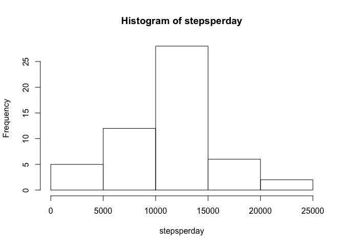
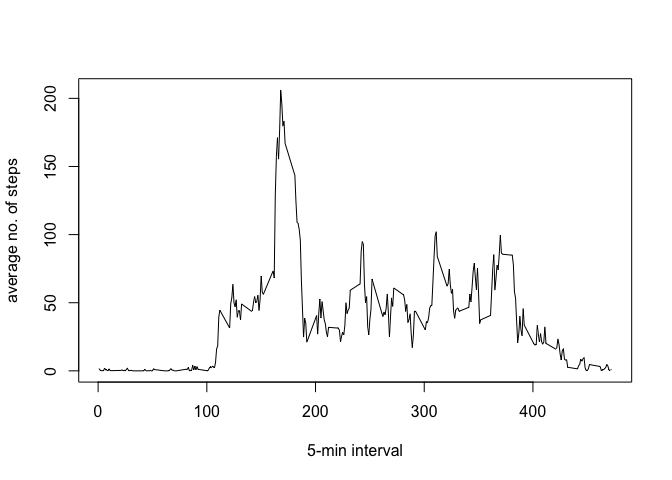

# Reproducible Research: Peer Assessment 1

<<<<<<< HEAD
## Loading and Processing the data


```r
data <- read.csv("activity.csv")
data$interval <- data$interval/5 + 1
for (i in 1:61) {
      levels(data$date)[i] <- i
}
```

## What is mean total number of steps taken per day?


```r
stepsperday <- tapply(data$steps,data$date,sum)
hist(stepsperday)
```

 

```r
meansteps <- mean(stepsperday, na.rm=T)
mediansteps <- median(stepsperday, na.rm=T)
```

The mean steps per day is 1.0766 &times; 10<sup>4</sup>. The median is 10765.

## What is the average daily activity pattern?


```r
stepsperinterval <- aggregate(data$steps~data$interval, data=data, mean, na.rm=T)
names(stepsperinterval)[names(stepsperinterval)=="data$steps"] <- "steps"
names(stepsperinterval)[names(stepsperinterval)=="data$interval"] <- "interval"

plot(stepsperinterval$interval, stepsperinterval$steps, type="l",xlab="5-min interval",ylab="average no. of steps")
```

 

```r
maxsteps <- stepsperinterval$interval[which.max(stepsperinterval$steps)]
```

On average across all days, the 168th 5-min interval contains the most steps.

## Imputing missing values


```r
numbermissing <- sum(is.na(data))
```

There are 2304 missing values in total.
